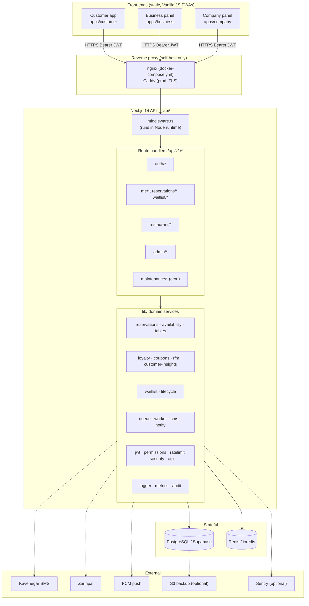
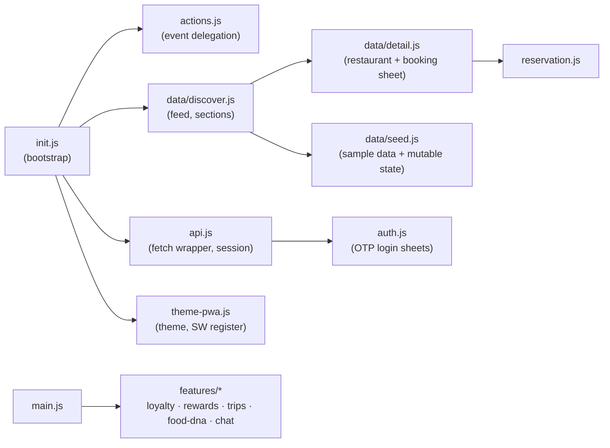
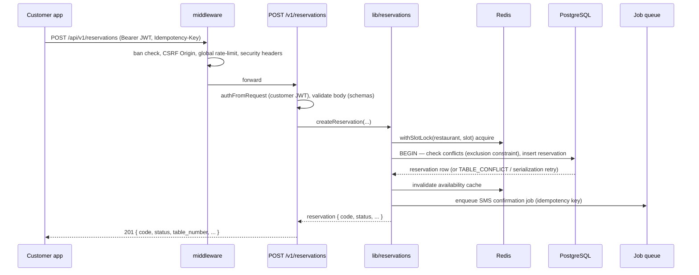
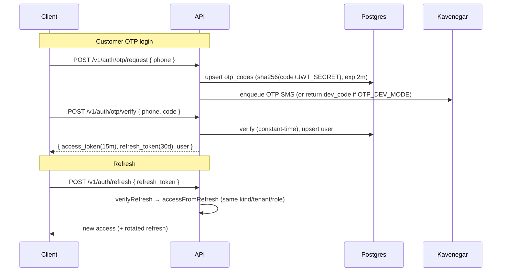
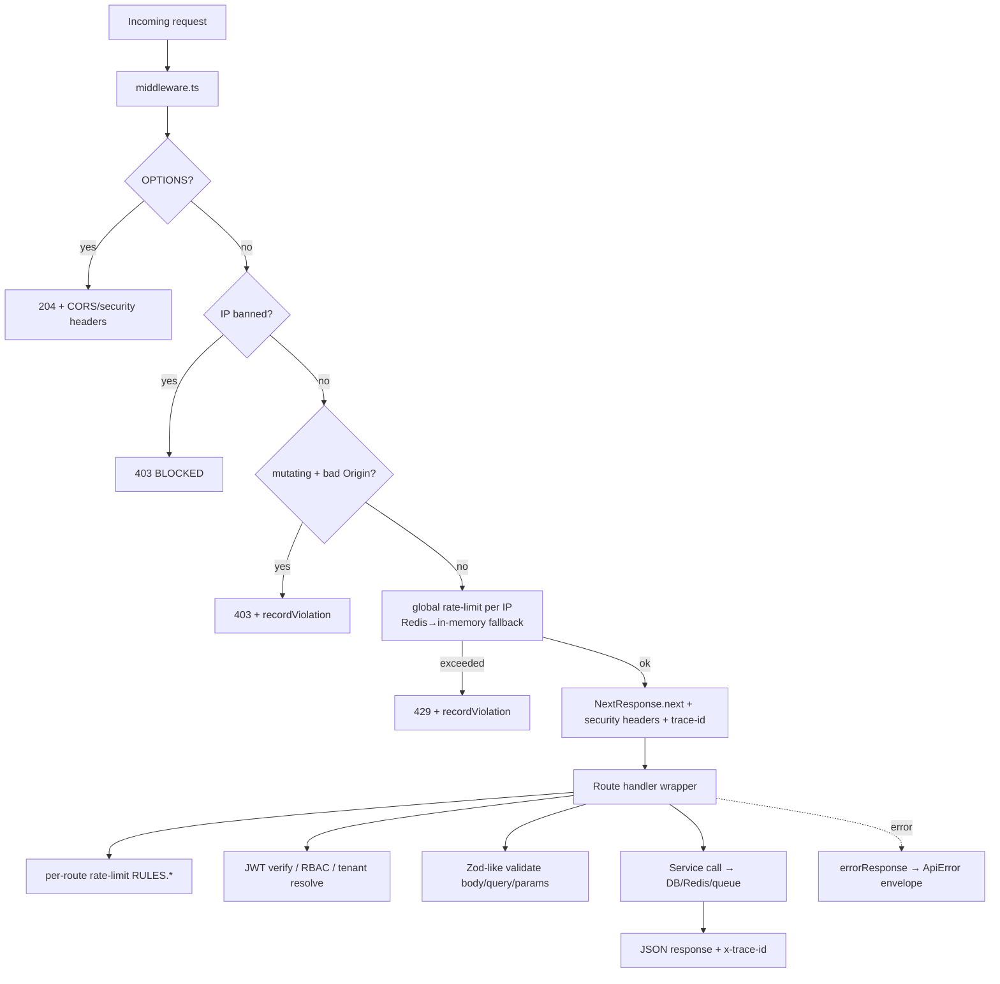
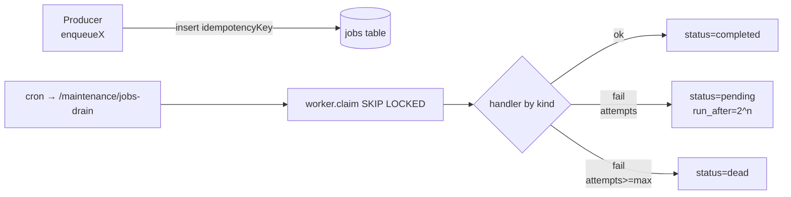

# ARCHITECTURE.md — RezervoNo

> System architecture derived from the merged repository. Diagrams are Mermaid.
> Uncertain inferences are marked **(uncertain)**.

---

## 1. High-Level Architecture



**Deployment topology**: front-ends and API are deployed independently
(different origins). CORS + `Origin` CSRF checks bridge them. On Vercel the
`middleware.ts` runs in the Node.js runtime (required, because it uses `ioredis`
TCP sockets — **not** Edge-compatible; documented in the middleware header).

---

## 2. Frontend Architecture

Each app is a **single `index.html`** plus an **ES-module graph** under `js/`
and CSS under `css/`. There is no build step for the apps themselves (modules
are served as-is); only `standalone/` bundles are "built".

### Customer app (`apps/customer/js`)


- **Bootstrap** (`init.js`): `boot()` runs on `DOMContentLoaded` (or deferred via
  `setTimeout(boot, 0)` when the DOM is already ready — this deferral avoids a
  module-init TDZ cycle and is required for `restoreSession()` and backend sync
  to run).
- **Session**: `api.js` stores `rz_access` / `rz_refresh` in `localStorage`;
  `restoreSession()` calls `/me` on load when a token exists.
- **Demo mode**: when the backend is absent, the app runs on `seed.js` sample
  data and accepts a demo OTP.

### Business & Company panels
Single-page vanilla-JS panels (`js/routing.js`, `js/data.js`, feature modules
like `overview.js`, `reservations.js`, `crm.js`, `marketing.js`, `staff-system.js`
for business; `overview.js`, `intelligence.js`, `restaurant.js` for company).

See [FRONTEND.md](./FRONTEND.md) for component/UI details.

---

## 3. Backend Architecture

**Controller → Service** style on top of Next.js route handlers:

- **Controllers** = `route.ts` files. They export HTTP method handlers
  (`GET`/`POST`/…) and contain *only* their specific logic.
- **Cross-cutting concerns** are wrappers:
  - `withRestaurantAuth(opts, handler)` — rate-limit → JWT → resolve staff's
    restaurant → RBAC permission → error envelope + trace + metrics.
  - `withStaffAuth(opts, handler)` — lighter (tenant-level, no restaurant entity).
  - `guardMaintenance(req)` — cron/maintenance auth (`x-maintenance-key` or
    `Authorization: Bearer ${CRON_SECRET}`).
  - `adminAuthFromRequest(req)` — platform-admin (owner of the platform tenant).
- **Services** = `lib/*` modules (domain logic, DB access, external calls).

See [BACKEND.md](./BACKEND.md) for the module map and dependency graph.

---

## 4. Shared Packages

There is **no compiled shared package**; sharing is by **source duplication**:

- `shared/css/{tokens,foundation,ds-bridge}.css` + `shared/js/icons.js` are the
  design-system source, copied into each `apps/*/css` and `apps/*/js`.
- The backend has no separate shared library beyond `api/src/lib`.

> **Implication (uncertain risk):** because the design system is duplicated per
> app, changes must be propagated to all three copies. See
> [KNOWN_LIMITATIONS.md](./KNOWN_LIMITATIONS.md).

---

## 5. Data Flow (booking, happy path)



Double-booking is prevented by **two layers**: a Redis slot-lock (optimization)
and a PostgreSQL **exclusion constraint over active statuses** (source of truth,
manual migration `016`). Serialization/conflict errors are retried
(`CONCURRENCY_RETRY`).

---

## 6. Authentication Flow

Three principal kinds, all issuing the same JWT pair (access 15m / refresh 30d,
HS256, `iss=rezervno`, `aud=rezervno-api`, separate secrets):



- **Customer**: `auth/otp/request` + `auth/otp/verify` → `kind: 'customer'`.
- **Staff**: `auth/staff/request` + `auth/staff/verify` → `kind: 'staff'` with
  `tenantId` + `role` (`owner`/`manager`/`staff`).
- **Platform admin**: a staff `owner` whose `tenantId === PLATFORM_ADMIN_TENANT_ID`
  (fail-closed if that env is unset).

Refresh tokens embed the principal so a refreshed access token keeps the same
kind/role (a previously-fixed bug downgraded staff → customer on refresh). A
`jti` is included to allow future revocation (a denylist).

---

## 7. Authorization Model

Two complementary layers:

1. **Role** (`owner` / `manager` / `staff` / `admin`) carried in the JWT.
   `owner` and `manager` bypass all permission checks.
2. **Modular RBAC** (`StaffPermission` table) for `role='staff'`, keyed by
   permission flags:

```
canManageReservations  canManageTables  canManageWaitlist
canViewAnalytics       canViewRevenue   canManageCampaigns
canManageCoupons       canManageStaff   canManageSettings
```

`requirePermission(auth, key)` looks up the *acting* staff's row (by
`auth.sub`), falling back to `SAFE_DEFAULTS` (only day-to-day ops enabled) when
no `StaffPermission` row exists. **Tenant isolation** is enforced by resolving
the staff's restaurant and scoping all queries to `restaurantId` / `tenantId`.

See [SECURITY.md](./SECURITY.md).

---

## 8. Request Lifecycle



Every handler runs inside `withTrace({ traceId, route })` and records HTTP
metrics (`recordHttp`).

---

## 9. Error Handling

- Domain errors: `ApiError(code, message, status, details)` created via the
  `Err` factory (`lib/errors.ts`). Examples: `OTP_INVALID` (401),
  `FORBIDDEN_TENANT` (403), `TABLE_CONFLICT` (409), `SLOT_LOCK_TIMEOUT` (423),
  `VALIDATION` (422), `RATE_LIMITED` (429), plus reservation-engine specifics
  (`RESTAURANT_CLOSED`, `NO_TABLE_FOR_PARTY`, `SLOT_FULL`, `PAST_TIME`,
  `TOO_FAR_AHEAD`, `PARTY_TOO_LARGE`, `INVALID_STATUS_TRANSITION`,
  `CONCURRENCY_RETRY`, `RESERVATION_EXPIRED`).
- Envelope: `{ "error": { "code", "message", "details" } }`.
- Unknown errors → logged (with trace) and returned as `{ code: 'INTERNAL' }`
  (500) — internal details are never leaked.

Full code table: [API_REFERENCE.md](./API_REFERENCE.md).

---

## 10. Caching

- **Availability cache** (`lib/availability-cache.ts`, `availability.ts`) —
  Redis-backed; invalidated on reservation create/change.
- **Platform settings** (`lib/platform-settings.ts`) — ~30s cache over the
  `platform_settings` table (payment merchant id, sandbox flag, etc.) so the
  company panel can change them without redeploy.
- **HTTP responses**: API responses are `Cache-Control: no-store` (set in
  middleware). Front-end static assets are cached by the service worker
  (`CACHE_VERSION`).
- General cache helpers: `lib/cache.ts`, `lib/redis.ts`.

---

## 11. Queue / Jobs

- **Postgres-based queue** (`jobs` table) using `FOR UPDATE SKIP LOCKED`
  (`lib/queue.ts`). Features: priority (1–9), idempotency key (dedup), retry
  with exponential backoff (`2^attempts`), dead-letter (`status='dead'` after
  `maxAttempts`), parallel workers.
- **Job kinds**: `sms`, `email`, `push`, `report`, `image`, `webhook`.
- **Worker** (`lib/worker.ts`) has a `handlers` map keyed by `job.kind`.
  (Placeholder `report`/`image` handlers were removed during the merge.)
- **Drain**: `POST /v1/maintenance/jobs-drain` (cron) claims + processes a batch.



---

## 12. Logging

- `lib/logger.ts` — structured logger with **trace context** (`withTrace`,
  `newTraceId`). Each request gets an `x-trace-id` (propagated from the client
  header or generated). Log level via `LOG_LEVEL` (`debug|info|warn|error`).
- Security/governance events are also persisted to the **`audit_logs`** table
  (`lib/audit.ts`): e.g. `auth.failure`, `staff.permission_change`.

---

## 13. Monitoring

- **Metrics**: `GET /api/metrics` (Prometheus-style, optionally protected by
  `METRICS_TOKEN`). `lib/metrics.ts` tracks active requests, HTTP durations, etc.
- **Health**: `GET /api/health`.
- **System health / security dashboards**: platform-admin endpoints
  (`/v1/admin/system-health`, `/v1/admin/security`).
- **Grafana + Prometheus**: `observability/` + `docker-compose.observability.yml`.
- **Sentry**: enabled when `SENTRY_DSN` is set.

---

## 14. External Services

| Service | Module | Purpose | Disabled when |
|---------|--------|---------|---------------|
| Kavenegar | `lib/sms.ts`, `sms-balance.ts` | OTP + lifecycle + campaign SMS | `KAVENEGAR_API_KEY` unset → logs only (needs `OTP_DEV_MODE` for login) |
| Zarinpal | `lib/zarinpal.ts` | Deposit payments (request + verify) | merchant id unset (from `platform_settings` or env) |
| FCM | `lib/notify.ts` | Web push | `FCM_SERVER_KEY` unset |
| Email | `lib/notify.ts` | Email notifications | `EMAIL_API_KEY` unset |
| Sentry | logger/metrics | Error reporting | `SENTRY_DSN` unset |
| S3 (backups) | `backup/` | Off-site DB backups | `S3_*` unset (local backup only) |

Payment redirect returns the user to
`${CUSTOMER_APP_URL}/reservations/{code}?payment=paid|failed`.
