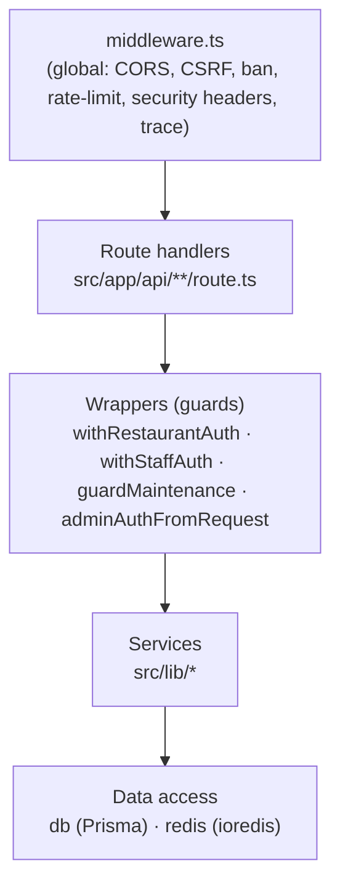
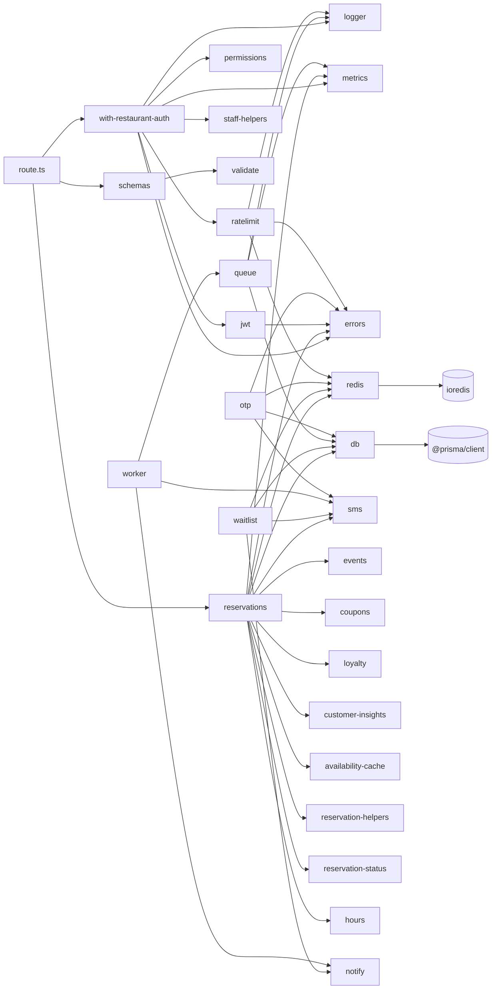

# BACKEND.md — RezervoNo API

> Next.js 14 (App Router) API under `api/`. "Controllers" are `route.ts` files;
> "services" are `src/lib/*` modules. No NestJS-style DI container — wiring is by
> import + wrapper functions.

---

## 1. Layers

---

## 2. Controllers (route handlers)

- Location: `src/app/api/**/route.ts`; each exports HTTP methods
  (`GET`/`POST`/`PUT`/`PATCH`/`DELETE`).
- They contain **only** their specific logic; auth/rate-limit/RBAC/error handling
  are delegated to wrappers.
- Request parsing/validation uses `schemas.ts` helpers: `parseBody`,
  `parseQuery`, `parseParams` with a Zod-like schema builder (`z`).

Full endpoint catalog: [API_REFERENCE.md](./API_REFERENCE.md).

---

## 3. Guards / Middleware

### Global middleware (`middleware.ts`, matcher `/api/:path*`)
Runs in the **Node.js runtime** (uses `ioredis`). In order: OPTIONS/CORS
preflight → IP ban check → CSRF `Origin` check (mutating methods) → global
per-IP rate limit (Redis, falling back to in-memory) → security headers + trace
id. All Redis calls are `try/catch` **fail-open** (with an in-memory rate-limit
floor) so the API never 500s if Redis is down.

### Route wrappers (`src/lib/with-restaurant-auth.ts`, `maintenance-auth.ts`, `admin-auth.ts`)
| Wrapper | Does |
|---|---|
| `withRestaurantAuth(opts, handler)` | per-route rate-limit → `authFromRequest` (JWT) → `resolveStaffRestaurant` (tenant isolation) → optional `requirePermission` (RBAC) → `errorResponse` envelope → trace + HTTP metrics. |
| `withStaffAuth(opts, handler)` | Lighter: rate-limit → JWT → handler (tenant-level, no restaurant entity). |
| `guardMaintenance(req)` | cron auth (`x-maintenance-key` or `Bearer CRON_SECRET`), constant-time compare. |
| `adminAuthFromRequest(req)` | platform-admin (owner of `PLATFORM_ADMIN_TENANT_ID`), fail-closed. |

---

## 4. Services (`src/lib/`, ~45 modules)

Grouped by concern:

### Auth & security
`jwt.ts` (HS256 sign/verify, refresh principal), `otp.ts` (OTP request/verify,
phone normalization, constant-time compare), `permissions.ts` (RBAC),
`admin-auth.ts`, `maintenance-auth.ts`, `ratelimit.ts` (sliding-window + ban +
in-memory fallback), `security.ts` (safe JSON, body-size cap), `idempotency.ts`.

### Reservation domain (core)
`reservations.ts` (create/availability engine; slot locks; conflict/serialization
retries; **DI port** for the no-show predictor), `reservation-helpers.ts`
(ranges, code gen, conflict/serialization detectors), `reservation-status.ts`
(active-status set), `reservation-lifecycle-ops.ts`, `lifecycle.ts` (state
machine), `availability.ts` + `availability-cache.ts`, `tables.ts`, `hours.ts`.

### Loyalty / CRM / marketing
`loyalty.ts` (points, gift cards), `coupons.ts` (validate/redeem atomically),
`rfm.ts`, `customer-insights.ts` (CLV, no-show risk, segments),
`guest-profile.ts`, `automation.ts` (trigger-based campaigns), `fraud.ts`.

### Waitlist / notifications / queue
`waitlist.ts` (join/offer/promote), `queue.ts` (Postgres job queue),
`worker.ts` (handlers by `job.kind`), `sms.ts` + `sms-balance.ts`, `notify.ts`
(push/email), `events.ts` (domain events emitter), `chat.ts`.

### Payments / platform
`zarinpal.ts` (request/verify payment), `platform-settings.ts` (cached
key/value settings), `subscription.ts` (plan/expiry), `staff-helpers.ts`
(resolve staff restaurant).

### Infra / observability
`db.ts` (Prisma client, pool config, optional read-replica `dbRead`),
`redis.ts` (ioredis client, slot lock helper `withSlotLock`, cluster support),
`cache.ts`, `logger.ts` (trace-aware), `metrics.ts` (Prometheus), `audit.ts`
(audit-log writer), `errors.ts` (ApiError + `Err` factory + `errorResponse`),
`validate.ts` + `schemas.ts` (Zod-like validation).

---

## 5. Repositories

There is **no repository layer**; services call the **Prisma client** (`db`)
directly, plus **raw SQL** (`db.$queryRaw` / `$executeRaw`) for performance-
critical paths (availability, conflict checks, queue claim with
`FOR UPDATE SKIP LOCKED`, aggregate CRM queries). An optional read-replica
client `dbRead` (in `db.ts`) routes heavy reads, falling back to primary.

---

## 6. Utilities

- `schemas.ts` / `validate.ts`: a small Zod-like validator. Domain primitives:
  `zPhone`, `zOtpCode`, `zUuid`, `zDateStr`, `zTimeStr`, `zPartySize`,
  `zReservationCode`. `parseBody/Query/Params` enforce and infer types.
  (`z.enum` uses a `const` type-param so it infers literal unions.)
- `logger.ts`: `createLogger(scope)`, `withTrace`, `newTraceId`.
- `metrics.ts`: counters/histograms + `recordHttp`.

---

## 7. Background Jobs

- Producers call `enqueueX` helpers (e.g. `enqueueSms`) which insert into the
  `jobs` table with an idempotency key.
- `POST /v1/maintenance/jobs-drain` (cron) claims a batch via
  `FOR UPDATE SKIP LOCKED` and dispatches to `worker.ts` `handlers[job.kind]`.
- Retry with exponential backoff (`run_after = now + 2^attempts`), dead-letter
  after `maxAttempts`. Kinds: `sms`, `email`, `push`, `report`, `image`,
  `webhook`.

Other cron endpoints run periodic domain maintenance (see
[API_REFERENCE.md#maintenance--cron](./API_REFERENCE.md)).

---

## 8. Configuration

- All config via **environment variables** (see [ENVIRONMENT.md](./ENVIRONMENT.md)).
- Security-critical config is validated **fail-fast but lazily** (first request
  in production), so `next build` never fails on a runtime var:
  - `JWT_SECRET` / `JWT_REFRESH_SECRET` must be ≥ 32 chars (`jwt.ts`).
  - `ALLOWED_ORIGINS` must be set in production (`middleware.ts`).
  - `OTP_DEV_MODE=true` in production is **rejected** (`otp.ts`) — prevents an
    auth bypass.
  - `PLATFORM_ADMIN_TENANT_ID` unset → admin panel fail-closed.
- Runtime, DB-backed config lives in `platform_settings` (cached ~30s) —
  editable from the company panel without redeploy (e.g. Zarinpal merchant id).

---

## 9. Dependency Graph (high level)

Notable design choices in the code:

- **Dependency inversion** in `reservations.createReservation`: it accepts the
  no-show predictor as a parameter (default wired in the module), decoupling the
  reservation core from the analytics module and making it unit-testable.
- **Cross-cutting concerns as wrappers**, not per-route duplication.
- **Postgres for the queue** (not Redis/SQS) so idempotency + atomic claim live
  in the same DB transaction.

---

## 10. Tests

- Unit tests: `api/tests/*.test.mts` (97 tests) run via
  `tsx --test --test-force-exit` — `--test-force-exit` is required because the
  queue module opens a Redis client that would otherwise keep the process alive.
- Coverage areas: `jwt`, `otp`, `validate`, `reservation-helpers`, `lifecycle`,
  `loyalty`, `queue`, `waitlist`.
- CI runs them against real Postgres + Redis service containers.
