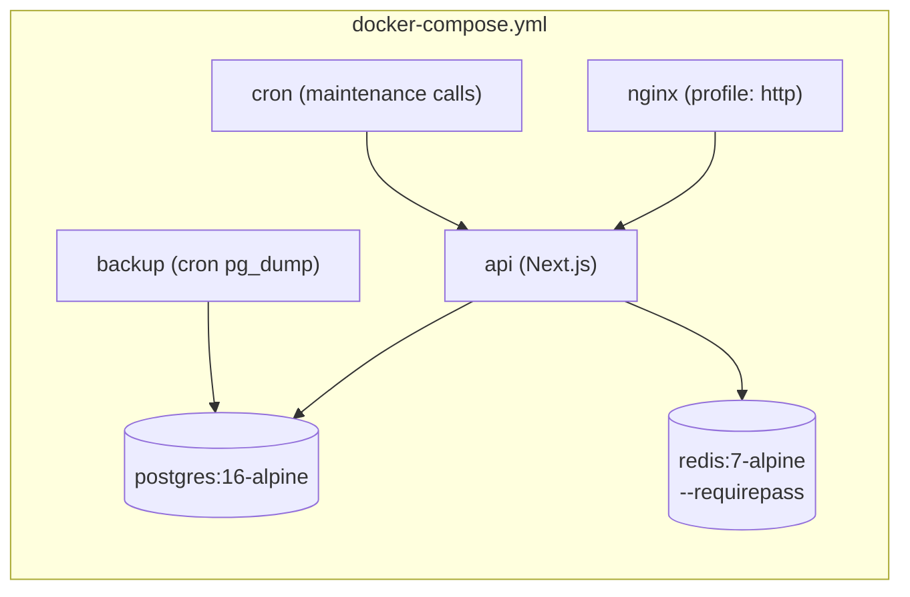

# DEPLOYMENT.md — RezervoNo

> Two supported deployment models: **Vercel (managed)** and **Docker Compose
> (self-host)**. Both are present in the repo.

---

## 1. Local Setup

```bash
git clone <repo> && cd RezervnoOS

# ── Backend ──
cd api
cp .env.example .env         # fill DATABASE_URL, REDIS_URL, JWT_SECRET, JWT_REFRESH_SECRET
npm install                  # postinstall runs `prisma generate`
# create schema (dev): either
npx prisma db push
# then apply the hand-written SQL (partitioning, exclusion constraint, RLS, ...)
sh prisma/apply-sql.sh       # runs prisma/sql/*.sql via prisma db execute
npm run db:seed              # optional demo data (prints platform tenant id)
npm run dev                  # http://localhost:3000

# ── Frontend (any static server; apps use absolute /paths) ──
npx serve apps/customer -l 8080
npx serve apps/business -l 8081
npx serve apps/company  -l 8082
```

Point the front-ends at the API by setting `API.base` (in `apps/*/js/api.js`)
or serving them behind the same origin as the API (nginx/Caddy do this).

---

## 2. Docker (single service)

`api/Dockerfile` is a hardened multi-stage build:
- **builder**: `npm ci` → `prisma generate` → `next build`.
- **runner**: `node:20-alpine`, non-root `nextjs` user, `dumb-init`,
  production-only deps + prisma CLI, copies `.next`, `public`, `prisma`,
  generated client. Exposes `3000`; `docker-entrypoint.sh` runs migrations then
  `next start`.

> **Migrations on boot.** The entrypoint runs `prisma migrate deploy` (baselining
> a pre-existing DB with `migrate resolve --applied 0_init` first, to avoid
> P3005), then `prisma/apply-sql.sh` to apply `prisma/sql/*.sql`. The
> hand-written SQL lives outside `migrations/`, so the old P3015 failure no
> longer happens. `apply-sql.sh` uses `prisma db execute` (the runtime image has
> no `psql`).

---

## 3. Docker Compose (self-host stack)

`docker-compose.yml` brings up the full stack with one command:



```bash
cp .env.example .env          # set POSTGRES_PASSWORD, REDIS_PASSWORD, JWT secrets, ...
docker compose up -d --build
docker compose exec api npx prisma db seed   # first run
```

Key facts (from `docker-compose.yml`):
- **postgres**: volume `pgdata`, healthcheck `pg_isready`. Port not exposed
  publicly (internal network only).
- **redis**: password-protected (`--requirepass`), `appendonly`, `maxmemory
  512mb` LRU. Healthcheck via `redis-cli ping`.
- **api**: depends on healthy postgres+redis; `NODE_ENV=production`;
  `OTP_DEV_MODE` defaults `false`; resource limits (2 CPU / 1G); healthcheck hits
  `/api/health`. Reads all secrets from `.env` (fails to start if
  `POSTGRES_PASSWORD` / `REDIS_PASSWORD` / `JWT_SECRET` / `JWT_REFRESH_SECRET`
  are missing).
- **nginx**: `profiles: ["http"]` (local, no TLS), serves the three front-ends +
  proxies the API; healthcheck `/healthz`. Config in `deploy/nginx/nginx.conf`.
- **backup**: scheduled `pg_dump` (`backup/scripts/*.sh`), retention
  `BACKUP_KEEP`, optional S3 upload (`S3_*`).
- **cron**: calls maintenance endpoints on a schedule (`cron/crontab`, `run.sh`).

### Production (TLS)
`docker-compose.prod.yml` swaps nginx for **Caddy** (`deploy/caddy/`) which
obtains/renews TLS automatically for `DOMAIN`.

### Observability
`docker-compose.observability.yml` adds Prometheus + Grafana (`observability/`).

---

## 4. Environment Variables

See [ENVIRONMENT.md](./ENVIRONMENT.md) for the full table. Minimum to boot the
API in production:

```
DATABASE_URL, DATABASE_DIRECT_URL, REDIS_URL (+ REDIS_PASSWORD self-host),
JWT_SECRET (≥32), JWT_REFRESH_SECRET (≥32, different), ALLOWED_ORIGINS, CRON_SECRET
```

---

## 5. Production Deployment — Vercel (managed)

- **API project**: Root Directory = `api`, framework Next.js (auto). Build =
  default (`postinstall` runs `prisma generate`; `next build`). Region `fra1`.
- **Cron**: defined in `api/vercel.json` (`crons`) — Vercel calls the
  `/api/v1/maintenance/*` endpoints on schedule, sending
  `Authorization: Bearer ${CRON_SECRET}`.
- **Env vars**: set in the Vercel dashboard (Production + Preview) — at minimum
  the list above, plus `KAVENEGAR_API_KEY`, `ZARINPAL_MERCHANT_ID`,
  `PLATFORM_ADMIN_TENANT_ID`, etc.
- **Front-ends**: static. Because `apps/*` use absolute asset paths, each app is
  intended as its own Vercel project with its own Root Directory
  (`apps/customer`, `apps/business`, `apps/company`). **(uncertain / follow-up)**:
  there is no root `vercel.json` wiring the front-ends; this is a dashboard
  configuration step. See [KNOWN_LIMITATIONS.md](./KNOWN_LIMITATIONS.md).
- **`.vercelignore`**: the root file must keep ignoring `api` + infra folders so
  a root deploy never treats `api/` as serverless functions.

Post-deploy checklist:
```bash
curl -s https://<domain>/api/health
curl -sI https://<domain>/api/v1/restaurants | grep -i "strict-transport\|x-frame"
# cron endpoints must 401 without the secret (protection active):
curl -s -o /dev/null -w "%{http_code}\n" https://<domain>/api/v1/maintenance/expire
```

---

## 6. Database Deployment

- **Supabase** (production Postgres). Use the **pooled** connection
  (`?pgbouncer=true&connection_limit=...`) for `DATABASE_URL` and a **direct**
  connection for `DATABASE_DIRECT_URL` (migrations only).
- **Schema**: the app build only `prisma generate`s. Apply schema via
  `prisma migrate deploy` (or `db push`) against the direct URL, then apply
  `prisma/sql/*.sql` with `sh prisma/apply-sql.sh` (or the Supabase connector).
  Verify: `npx prisma migrate status`.
- **RLS** is defined for newer tables (`prisma/sql/023`).

---

## 7. Secrets

- Never commit `.env` (git-ignored). Only `.env.example` is committed with
  placeholders.
- Generate strong secrets: `openssl rand -base64 48` for
  `JWT_SECRET` / `JWT_REFRESH_SECRET` / `CRON_SECRET` / `MAINTENANCE_KEY` /
  `REDIS_PASSWORD`.
- Runtime provider secrets (Zarinpal merchant id, Kavenegar key) can live in
  `platform_settings` (editable from the company panel) with env as fallback.
- Set secrets in Vercel dashboard (managed) or `.env` on the host (self-host).

---

## 8. Rollback Strategy

- **Code (Vercel)**: use **Instant Rollback** to the previous deployment (each
  push is an immutable deployment). Self-host: redeploy the previous image tag
  (`docker compose up -d --build` from the prior commit).
- **Database**:
  - Backups: `backup/scripts/restore.sh` restores a `pg_dump` snapshot; `list.sh`
    lists available backups; retention `BACKUP_KEEP`, optional S3 copies.
  - **Forward-only migrations**: manual SQL migrations are not auto-reversible —
    write compensating scripts for risky changes and test restore from backup
    before schema changes.
- **Feature flags**: several behaviors are DB-driven (`paymentEnabled`,
  `platform_settings`, plan controls via `/admin/restaurants/[id]/control`), so
  risky features can be disabled without a redeploy.
