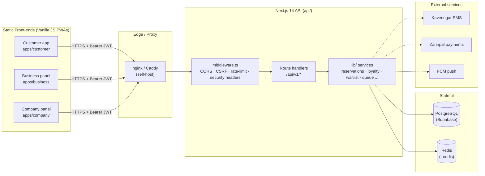

# PROJECT_KNOWLEDGE.md — RezervoNo

> Canonical knowledge base for the RezervoNo platform. Generated from the
> merged repository (branch `main`). This document describes **what exists in
> the code today**, not aspirations. Where the code is ambiguous, it is called
> out explicitly with **(uncertain)**.

---

## 1. Project Overview

**RezervoNo** (رزرونو) is a multi-tenant **restaurant-reservation SaaS** targeting
Iran's Gen‑Z market. It is a Persian / RTL product built around three separate
front-end applications that all talk to a single Next.js backend API:

| App | Audience | Location | Description |
|-----|----------|----------|-------------|
| **Customer app** | Diners (public) | `apps/customer/` | PWA to discover restaurants, book tables, join waitlists, earn loyalty points, chat with restaurants. |
| **Business panel** | Restaurant staff | `apps/business/` | Single-page panel for reservations, tables, waitlist, CRM, marketing, staff. |
| **Company panel** | Platform admins | `apps/company/` | Platform-owner console (all tenants, billing, SMS, security, settings). |
| **API** | All clients | `api/` | Next.js 14 App Router route handlers + Prisma + PostgreSQL + Redis. |

Supporting outputs derived from the apps:

- `standalone/` — single-file offline HTML bundles (generated by `tools/build-standalone.py`).
- `demo-mvp/` — deployable offline demo + design preview.
- `shared/` — the shared design system source (tokens / foundation / bridge CSS + icons).

---

## 2. Business Goals

- Let diners **book a table in seconds**, "as easy as sending a message".
- Give restaurants a **full operations panel**: real-time table state, smart
  table allocation, waitlist, no-show risk, CRM (RFM / CLV segments), coupons,
  automated marketing, and SMS.
- Give the platform operator a **multi-tenant control plane**: onboarding,
  billing/plan management, SMS balance top-ups, security auditing, and
  platform-wide settings (e.g. payment gateway toggles).
- Monetize via **subscription plans** (`free`/`starter`/`pro`/`enterprise`), SMS
  credit sales, and optional online **deposit payments** (Zarinpal).

---

## 3. Architecture Summary



Key architectural properties (all present in code):

- **Separation of front-end and back-end.** Front-ends are static assets served
  independently; the API is a separate Next.js deployment. Auth is **Bearer
  JWT** in the `Authorization` header (no cookies), so the API is
  CSRF-resistant by design, with an `Origin` check as defense-in-depth.
- **Multi-tenancy.** `Tenant → Restaurant(s) → Staff/Tables/Reservations`.
  Every restaurant-scoped route resolves the acting staff's restaurant and
  enforces tenant isolation (`with-restaurant-auth.ts`).
- **Reservation engine** with Redis slot-locks + PostgreSQL exclusion
  constraints as the source of truth against double-booking (`lib/reservations.ts`,
  manual migration `016-exclude-constraint-active-statuses.sql`).
- **Background jobs** on a Postgres-based queue (`FOR UPDATE SKIP LOCKED`),
  drained by cron (`lib/queue.ts`, `lib/worker.ts`).
- **Observability**: structured logging with trace IDs, Prometheus-style
  metrics endpoint, optional Sentry, Grafana dashboards under `observability/`.

See [ARCHITECTURE.md](./ARCHITECTURE.md) for the full breakdown.

---

## 4. Technology Stack

### Frontend
- **Vanilla JavaScript ES modules** (no framework). Each app is a single
  `index.html` + `js/` module graph + `css/`.
- **Design system**: `tokens.css` (design tokens) → `foundation.css` (base) →
  `ds-bridge.css` (bridge to legacy class names), plus `icons.js`. Source lives
  in `shared/` and is copied into each app.
- **PWA**: service worker (`sw.js`) with a versioned cache (`CACHE_VERSION`),
  `manifest.webmanifest`.
- **RTL / Persian**, Vazirmatn font.

### Backend
- **Next.js 14** (App Router) — API-only, route handlers under
  `api/src/app/api/`.
- **Prisma** ORM + **PostgreSQL** (Supabase in production).
- **Redis** via **ioredis** — rate limiting, slot locks, caches, OTP throttling.
- **jsonwebtoken** — HS256 access/refresh tokens.
- **TypeScript** (strict `tsc --noEmit` gate).
- Node's built-in **test runner** via `tsx` (`*.test.mts`).

### External services
- **Kavenegar** — SMS (OTP, lifecycle notifications, campaigns).
- **Zarinpal** — online deposit payments.
- **FCM** — web push (optional).
- Optional: **Sentry** (errors), **Grafana/Prometheus** (metrics), S3-compatible
  object storage (DB backups).

### Tooling
- **Docker / Docker Compose** for self-hosting (`docker-compose*.yml`).
- **Vercel** for the managed deployment (API as a separate project).
- **Playwright** for E2E (`e2e/`), **k6** for load tests (`loadtest/`).
- **GitHub Actions** for CI (`.github/workflows/ci.yml`).

---

## 5. Repository Structure

```
/
├── apps/
│   ├── customer/        # Customer PWA (ES modules)
│   ├── business/        # Restaurant staff panel
│   └── company/         # Platform admin panel
├── shared/              # Design-system source (css tokens/foundation/bridge, icons.js)
├── standalone/          # Generated single-file offline bundles
├── demo-mvp/            # Offline demo + design preview (deployable)
├── design-preview/      # Design system preview page(s)
├── tools/
│   └── build-standalone.py   # Bundles apps/* → standalone/*.html
├── api/                 # Next.js 14 backend (separate Vercel project)
│   ├── src/app/api/     # Route handlers (/api/v1/*)
│   ├── src/lib/         # Services / domain logic (~45 modules)
│   ├── prisma/          # schema.prisma, migrations/, seed
│   ├── middleware.ts    # Global CORS/CSRF/rate-limit/security headers
│   └── tests/           # Unit tests (*.test.mts)
├── deploy/              # nginx + caddy reverse-proxy configs
├── backup/              # DB backup scripts + data dir
├── cron/                # Cron job definitions (maintenance/backup)
├── observability/       # Grafana dashboards, prometheus config
├── e2e/                 # Playwright end-to-end tests (customer app)
├── loadtest/            # k6 load tests
├── docs/               # Documentation (this folder)
├── docker-compose.yml           # Local/self-host stack
├── docker-compose.prod.yml      # Production (Caddy + TLS)
├── docker-compose.observability.yml
├── .vercelignore        # MUST ignore api/infra for root deploys (see note below)
└── CLAUDE.md            # Repo working rules
```

> **Note on `api/` at the repo root.** In Vercel, a root-level `api/` folder is a
> reserved serverless-functions directory. The root **`.vercelignore` must always
> ignore `api` and infra folders** so a root deployment never treats them as
> functions. The API is deployed as its **own** Vercel project with
> **Root Directory = `api`**.

---

## 6. Development Workflow

```bash
# 1. Backend
cd api
cp .env.example .env          # fill DATABASE_URL, REDIS_URL, JWT secrets, ...
npm install                   # runs `prisma generate` via postinstall
npx prisma db push            # or migrate; then `sh prisma/apply-sql.sh` (prisma/sql/*.sql)
npm run db:seed               # optional demo data
npm run dev                   # next dev on :3000

# 2. Frontend (any static server; assets use absolute /paths)
npx serve apps/customer -l 8080     # or business / company

# 3. E2E (customer app, fully mocked API)
cd e2e && npm install && npx playwright install --with-deps chromium webkit
BASE_URL=http://localhost:8080 npm test
```

Full recipes: [DEPLOYMENT.md](./DEPLOYMENT.md).

---

## 7. Coding Conventions

Derived from `CLAUDE.md` and observed code style:

- **Surgical changes, never rewrites.** Don't touch healthy files.
- **Persian comments and commit messages.** Commit messages state *what*, *why*,
  and whether the change was **"tested"** or **"only type-checked"** — never
  overstate validation.
- **snake_case** database columns via Prisma `@map`; camelCase in TypeScript.
- **Enums, not free strings** for status/role/plan fields (prevents invalid
  values like `'PRO'`).
- **Domain errors** are thrown as `ApiError` from the `Err` factory
  (`lib/errors.ts`) — never ad-hoc `throw new Error` in request paths.
- **Cross-cutting concerns** (auth, rate-limit, RBAC, error envelope) live in
  wrappers (`withRestaurantAuth`, `withStaffAuth`, `guardMaintenance`), not
  duplicated per route.
- **Fail-fast on missing security config** (JWT secret length, `ALLOWED_ORIGINS`
  in production) — but *lazily*, so `next build` never fails on a runtime var.
- **Front-end:** relative asset paths inside `/business` & `/company` legacy;
  ES modules must resolve to real files; when anything under `js/` or `css/`
  changes, **bump `CACHE_VERSION` in `sw.js`** (`rezervno-vN → vN+1`).
- **Never break demo mode.** The front-end must accept a demo OTP when the
  backend is absent. Demo data must be labelled `[DEMO]`.
- **Markdown-tail check.** Historically some `.ts/.js` files had stray markdown
  (`##`, `---`) appended after code — scan for it before merging.

---

## 8. Branch Strategy

- Default branch: **`main`** — every push auto-deploys to Vercel.
- Feature work happens on branches (e.g. `claude/<topic>`), opened as PRs into
  `main`. CI must be green before merge.
- **High-risk changes** (DB schema, auth, reservation/double-booking logic) go
  through a **PR** rather than a direct push.
- CI also watches `develop` (see `ci.yml` `on:` triggers), though `main` is the
  production line. **(uncertain: whether `develop` is actively used.)**

---

## 9. Deployment Flow

Two supported models — both present in the repo:

### A) Managed (Vercel) — production
- **API**: a Vercel project with Root Directory `api`, framework Next.js.
  Build = `prisma generate && next build`; `postinstall` also runs
  `prisma generate`. Cron endpoints are wired via `api/vercel.json` `crons`.
- **Front-ends**: static. Because `apps/*` use absolute asset paths, each app is
  intended to be deployed with its own Root Directory (`apps/customer`, etc.).
  **(uncertain / follow-up: no root `vercel.json` wires the front-ends; this is
  a Vercel-dashboard configuration task, see [KNOWN_LIMITATIONS.md](./KNOWN_LIMITATIONS.md).)**
- **DB**: Supabase; migrations applied out-of-band (schema is generated at build,
  manual SQL applied via the Supabase connector).

### B) Self-host (Docker Compose)
- `docker-compose.yml`: `postgres`, `redis`, `api`, `nginx`, `backup`, `cron`.
- `docker-compose.prod.yml`: adds **Caddy** for automatic TLS.
- `docker-compose.observability.yml`: Prometheus + Grafana.

Details + rollback: [DEPLOYMENT.md](./DEPLOYMENT.md).

---

## 10. Build Pipeline

- **API build**: `npm run build` = `prisma generate && next build`. Type gate:
  `tsc --noEmit` (zero errors required).
- **Standalone bundles**: `python3 tools/build-standalone.py` reads `apps/*` and
  emits self-contained `standalone/{customer,business,company}.html` (inlines
  CSS/JS; merges the customer ES modules into one classic script so `file://`
  works). `standalone/` is a generated artifact.
- **Service worker cache**: `CACHE_VERSION` in each app's `sw.js` must be bumped
  when `js/`/`css/` change, otherwise clients keep the stale cache.

---

## 11. CI/CD Explanation

`.github/workflows/ci.yml` runs 4 jobs on push/PR to `main`/`develop`:

| Job | What it does |
|-----|--------------|
| **build** | `npm ci` → `prisma generate` → `tsc --noEmit` → `next build` (with dummy env). |
| **test** | Spins up **Postgres 17 + Redis 7** services; `prisma db push` + `sh prisma/apply-sql.sh` (applies `prisma/sql/*.sql`); runs `npm test` (unit tests via `tsx --test --test-force-exit`). |
| **security** | `npm audit --audit-level=critical` (fails on critical) + `--audit-level=high` (warns only). |
| **e2e** | Installs Playwright (chromium + webkit), runs the customer-app E2E suite against a locally-served `apps/customer` with a **fully mocked API** (3 device projects: mobile-safari, mobile-chrome, desktop-chrome). Uploads the Playwright report artifact. |

CD is **Vercel auto-deploy on push to `main`** (each push also creates preview
deployments for the API + front-end projects).

> **CI history worth knowing** (fixed, but instructive):
> - `test` job used `prisma migrate deploy`, which choked on the non-migration
>   `prisma/migrations/manual/` folder (P3015). That folder was moved to
>   `prisma/sql/` and is now applied via `prisma/apply-sql.sh`.
> - The test process hung because a Redis client (from the queue module) kept
>   the event loop alive → added `--test-force-exit`.
> - E2E needed `serviceWorkers: 'block'` so reloads re-run the app bootstrap.
