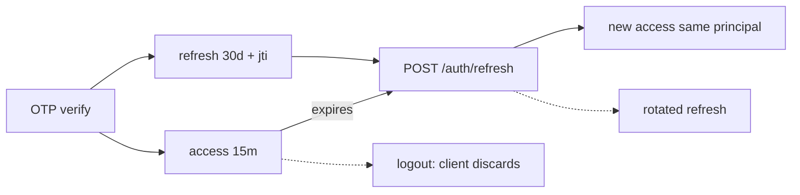

# SECURITY.md — RezervoNo

> Security model as implemented in `api/` (middleware + `lib/`). This reflects
> the code today; treat "Recommendations" as forward-looking.

---

## 1. Authentication

- **Stateless JWT** (`jsonwebtoken`), **HS256** explicitly (blocks `alg:none` /
  algorithm-confusion), with `issuer='rezervno'` and `audience='rezervno-api'`.
- **Separate secrets** for access and refresh; both must be **≥ 32 chars**
  (fail-fast in `jwt.ts`).
- **Access** token: 15 min. **Refresh**: 30 days, contains a `jti` and the full
  principal (`kind` + `tenantId`/`role` for staff) so a refresh re-issues a
  same-kind access token.
- **OTP** (`lib/otp.ts`): 6-digit code, `sha256(code + JWT_SECRET)` stored in
  `otp_codes`, 2-minute TTL, **max 5 verify attempts**, constant-time comparison
  (`timingSafeEqual`). Phone normalized to `+98…`. `OTP_DEV_MODE=true` is
  **rejected in production** (would leak the code → auth bypass).
- Three principals: **customer**, **staff** (`owner`/`manager`/`staff`),
  **platform-admin** (staff `owner` of `PLATFORM_ADMIN_TENANT_ID`, fail-closed).

---

## 2. Authorization

- **Role gate**: `owner`/`manager` bypass fine-grained checks.
- **Modular RBAC** (`StaffPermission`) for `role='staff'` with safe defaults
  (day-to-day ops only; analytics/revenue/settings off by default).
  `requirePermission` looks up the **acting** staff by `auth.sub` (a prior bug
  used `findFirst` by tenant → privilege leakage; fixed).
- **Tenant isolation**: restaurant-scoped routes resolve the staff's restaurant
  and scope every query to `restaurantId`/`tenantId`. Cross-tenant access →
  `FORBIDDEN_TENANT`.
- **Platform admin fail-closed**: if `PLATFORM_ADMIN_TENANT_ID` is unset, admin
  routes deny everyone (previously they would have let any restaurant owner in).

---

## 3. Token Lifecycle

- Refresh preserves principal (kind/tenant/role).
- `jti` enables a future **revocation denylist** (logout / staff deactivation).
  `Staff.isActive=false` is intended to reject that staff's refresh. **(uncertain
  / verify)** whether a denylist is fully wired for access tokens; access tokens
  are short-lived (15 min) which bounds exposure.

---

## 4. Session Handling

- **No cookies / no server sessions** for the API — Bearer tokens only. This is
  the primary CSRF mitigation.
- Front-ends store tokens in `localStorage` (`rz_access`/`rz_refresh`) and auto-
  refresh on 401. (Trade-off: `localStorage` is readable by JS, so XSS
  discipline matters — see below.)

---

## 5. CSRF

- Bearer-token auth (no ambient cookies) makes the API CSRF-resistant by design.
- **Defense-in-depth**: `middleware.ts` checks the `Origin` header on mutating
  methods (`POST/PUT/PATCH/DELETE`) against `ALLOWED_ORIGINS`; a bad origin →
  `403` + violation recorded. Requires `ALLOWED_ORIGINS` set in production
  (fail-fast otherwise).

---

## 6. XSS

- API responses are JSON with `Content-Security-Policy: default-src 'none';
  frame-ancestors 'none'`, `X-Content-Type-Options: nosniff`,
  `X-Frame-Options: DENY`, `Referrer-Policy: strict-origin-when-cross-origin`,
  and `Permissions-Policy` disabling geolocation/camera/mic/payment on the API
  origin.
- **Front-end** renders HTML template strings; user-controlled text is escaped
  via an `esc()` helper before interpolation. **(recommendation)** audit every
  `innerHTML` sink to ensure all external/user data passes through `esc()`.
- **HSTS**: `Strict-Transport-Security: max-age=63072000; includeSubDomains;
  preload`.

---

## 7. SQL Injection Protection

- **Prisma** parameterizes all model queries.
- **Raw SQL** uses `Prisma.sql` / tagged `$queryRaw` with **parameterized**
  fragments (e.g. the active-status set is built with `Prisma.join([...Prisma.sql])`,
  not string concatenation) — this specifically fixed an earlier incomplete
  status list.
- Input is validated by the Zod-like schemas before reaching queries.

---

## 8. Rate Limiting & Abuse Protection

- **Sliding-window log** in Redis (sorted sets), atomic via `MULTI`
  (`lib/ratelimit.ts`).
- **Layers**: global per-IP (middleware) + per-route rules (`RULES`):
  - OTP request: 3/10m per phone, 15/10m per IP; OTP verify: 8/10m per IP.
  - reservations: 10/min; search: 60/min; auth: 20/min; global: 120/min per IP.
- **Auto-ban**: ≥ 10 rate-limit violations in 5 min → IP banned for 1 hour.
- **Fail-open with a floor**: if Redis is down, middleware falls back to an
  **in-memory** per-process limiter (a DDoS floor, not full protection) rather
  than removing all limits.
- **Client IP** is derived safely (prefers `X-Real-IP`/`CF-Connecting-IP`, else
  the **right-most** `XFF` hop) to prevent spoofing (`TRUST_PROXY_HEADERS` gates
  this).

---

## 9. Secrets Management

- No secrets in git; only `.env.example` placeholders. `.env` is git-ignored.
- Fail-fast validation of critical secrets (JWT length, `ALLOWED_ORIGINS`).
- Self-host: Redis/Postgres require passwords even on the internal network
  (defense against lateral movement). Containers run **non-root**.
- Runtime provider secrets can live in `platform_settings` (DB), editable from
  the company panel, with env fallback.

---

## 10. Other Controls

- **SSRF guard**: outbound webhooks reject private/internal addresses unless
  `ALLOW_PRIVATE_WEBHOOKS=true` (dev only); webhooks are HMAC-signable.
- **Idempotency**: `Idempotency-Key` on reservation POST prevents double-charge/
  double-book on retries.
- **Audit log**: security/governance events persisted to `audit_logs`
  (auth failures, permission changes) with trace ids.
- **Dependency audit** in CI: `npm audit --audit-level=critical` **fails** the
  build; `high` warns.
- **CI secrets**: E2E mocks the API entirely (no real backend/secrets in E2E).

---

## 11. Security Recommendations (forward-looking)

1. **Verify/implement token revocation** end-to-end (access-token denylist keyed
   by `jti`; ensure logout + `Staff.isActive=false` reject tokens promptly).
2. **XSS audit** of all front-end `innerHTML` sinks; consider moving tokens from
   `localStorage` to memory + refresh-cookie if a stronger XSS posture is needed.
3. **Rotate secrets** regularly; ensure `CRON_SECRET`/`MAINTENANCE_KEY` are set
   in every environment (cron endpoints must never be public).
4. **RLS everywhere**: extend Row-Level Security (started in `manual/023`) to all
   tenant-scoped tables as defense-in-depth behind the application checks.
5. **Alerting** on the rate-limit fail-open path and auto-bans (currently
   log-only in places).
6. **Pen-test the payment callback** (`/payments/callback`) — it is
   intentionally unauthenticated and relies on `authority + code + amount`
   matching; confirm amount/authority binding is strict.
