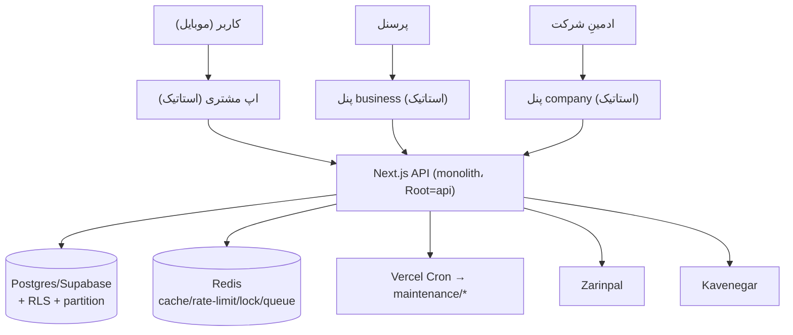
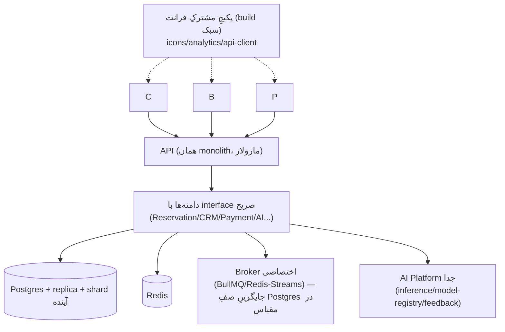

# ARCHITECTURE_AUDIT_FINAL — رزرونو (سندِ جمع‌بندیِ معماری)

> جمع‌بندیِ ممیزیِ معماری از دیدِ Chief Software Architect. تاریخ: ۲۰۲۶-۰۷-۳۰.
> مکملِ `docs/backend-audit/` (۸ گزارشِ عمیقِ بک‌اند) و سه سندِ کنارِ همین پوشه.
> **حوزه: ممیزی — بدونِ refactorِ کور. توصیه‌ها evidence-based و با روڈمپِ تدریجی.**

---

## ۰) حکمِ کلی
معماری برای مقیاسِ فعلی و رشدِ کوتاه/میان‌مدت **سالم و production-گرا** است: بک‌اند لایه‌بندیِ تمیز،
دفاعِ چندلایه‌ی رزرو، امنیتِ قوی، observability. ضعف‌های اصلی **در لایه‌ی فرانت** (تکرارِ کدِ بینِ سه اپ،
نبودِ build) و **آمادگیِ مقیاسِ خیلی‌بزرگ** (صفِ Postgres، AI heuristic) است — هیچ‌کدام مسدودکننده‌ی تولید نیست.

## ۱) کارت‌امتیازِ معماری (۰–۱۰)
| دسته | نمره | مبنا |
|------|------|------|
| Project Structure | ۷.۵ | جداسازیِ deploy تمیز؛ تکرارِ فرانت |
| Backend Architecture | ۸.۷ | لایه‌بندی/guard/DIP (backend-audit) |
| Frontend Architecture | ۷.۰ | customer عالی؛ business/company global-script + تکرار |
| Database Architecture | ۹.۰ | index/FK/RLS/exclusion/partition (backend-audit) |
| API Architecture | ۸.۵ | نسخه‌بندی، envelope یکدست، rate-limit |
| Security Architecture | ۸.۸ | JWT سخت، RBAC، CSRF/CORS، ۰ raw ناایمن |
| AI Architecture | ۶.۵ | heuristic منزوی؛ نه مدلِ آموزش‌دیده/versioned |
| Scalability | ۷.۵ | pooling/replica؛ صفِ Postgres سقفِ >۱۰۰k |
| Maintainability | ۷.۵ | کامنت‌محور/تست‌دار؛ تکرارِ فرانت بدهی است |
| Performance | ۸.۳ | کش/replica/متریک؛ بنچمارک runtime نشده |
| Developer Experience | ۷.۵ | بدون build ساده ولی الگوهای دوگانه |
| Production Readiness | ۸.۴ | health/shutdown/CI؛ DR/alerting باز |
| Enterprise Readiness | ۷.۵ | multi-tenant + RLS؛ i18n/multi-currency ثابت (fa/IRR) |

### نمره‌ی کلیِ معماری: **۷.۹ / ۱۰**

## ۲) معماریِ فعلی (نمودار)

## ۳) معماریِ پیشنهادی (هدفِ رشد — تدریجی، نه بازنویسی)

> تغییرِ کلیدی: **مونولیتِ ماژولار بماند** (میکروسرویس زودهنگام = over-engineering)؛ فقط صف، AI و
> پکیجِ مشترکِ فرانت به‌تدریج جدا شوند.

## ۴) نقاطِ قوت
دفاعِ چندلایه‌ی double-booking · JWT/RBAC سخت · pooling+replica · idempotency · rate-limit چندلایه ·
هدرهای امنیتی کامل · health واقعی · ۰ raw SQL ناایمن · دیزاین‌سیستمِ تک‌منبع (CSS) · تستِ واحدِ منطقِ حساس · اپ مشتریِ ES-moduleِ تمیز.

## ۵) ریسک‌ها (به تفکیکِ شدت)
| شدت | ریسک | حوزه |
|-----|------|------|
| **بحرانی** | — (موردِ بحرانیِ کدمحور یافت نشد) | — |
| **بالا** | نبودِ DR/backup runbook + restore-drill | تولید/عملیات |
| بالا | تکرارِ کدِ فرانت (icons/analytics/api) → واگرایی/باگِ خزنده | فرانت/نگه‌داری |
| متوسط | صفِ Postgres در >۱۰۰k همزمان | مقیاس |
| متوسط | AI heuristic (نه مدلِ واقعی/versioned) | قابلیت |
| متوسط | i18n/multi-currency ثابت (fa/IRR) برای «multi-country» | enterprise |
| متوسط | تأییدِ runtimeِ RLS روی همه‌ی جداول + alerting/SLO | امنیت/عملیات |
| متوسط | وابستگیِ ترتیبِ `<script>` در business/company | فرانت |
| پایین | ۳ endpointِ orphan-candidate + چند Orphan-UI | تمیزکاری |
| پایین | ~۳۲ any-cast، ۴ console (backend-audit) | بدهی |

## ۶) بدهیِ فنی و گلوگاه‌ها
- به `docs/backend-audit/TECHNICAL_DEBT_REPORT.md` و `PERFORMANCE_REPORT.md` رجوع شود
  (صفِ Postgres، any-cast، بنچمارک). بدهیِ فرانت: تکرارِ سه‌گانه + الگوی ماژولِ دوگانه.

## ۷) اولویت‌های refactor / migration (روڈمپ)
1. **عملیاتی-فوری (بدونِ کد):** DR runbook + restore-drill، alert rules (۵xx/DB-down/صفِ عقب‌افتاده)، load-test (k6).
2. **تأییدِ runtime:** `pg_policies` برای RLS، مرورِ SSRF در webhookها، drift-check اسکیمای CI.
3. **تمیزکاریِ کم‌ریسک (PRهای جدا):** تأیید و طبقه‌بندیِ ۳ endpointِ orphan؛ رفع/اتصالِ Orphan-UIها؛ حذفِ any/console.
4. **ادغامِ فرانت (متوسط):** یک پکیجِ مشترکِ سبک برای icons/analytics/api-client (به CONSOLIDATION).
5. **مقیاسِ بلندمدت:** broker صف، AI Platformِ جدا با model-registry/feedback، i18n/currency abstraction.

## ۸) آمادگیِ رشدِ آینده
با اجرای ۱–۳ (عملیاتی + تأیید + تمیزکاری) پلتفرم برای رشد تا ده‌ها‌هزار رستوران آماده است؛ گام‌های
۴–۵ برای مقیاسِ جهانی/چندکشوری لازم می‌شوند اما **نیازی به بازنویسیِ کدِ سالمِ فعلی نیست** —
همه تدریجی و رو به عقب‌سازگارند.
