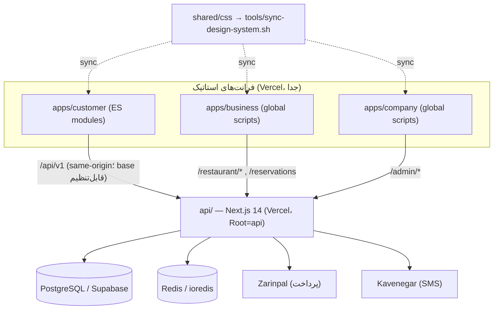
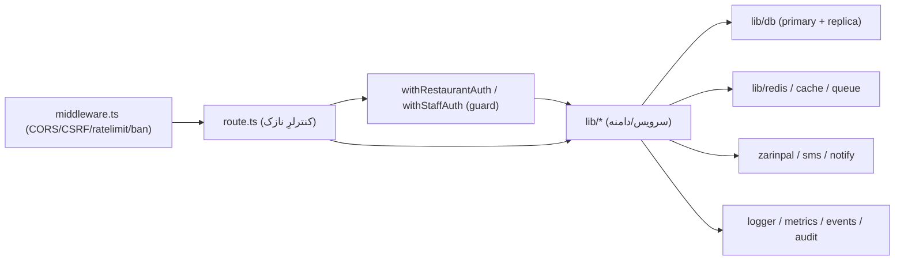

# DEPENDENCY_GRAPH — رزرونو

> گرافِ وابستگی + بررسیِ چرخه/لایه/پکیج. تاریخ: ۲۰۲۶-۰۷-۳۰.

---

## ۱) نمای کلانِ deploy-unitها

## ۲) گرافِ لایه‌ی بک‌اند (جهتِ درست)

- جهتِ وابستگی: **route → lib → infra**. برعکس (lib→route) وجود ندارد. ✅

## ۳) چرخه‌ها (Circular)
- **بک‌اند:** با تکیه بر پاس‌شدنِ `tsc --noEmit` (۰ ارور) و الگوهای عمدیِ ضدِچرخه:
  - `db.ts` واردکردنِ `metrics` را **lazy** (`import().then`) انجام می‌دهد تا چرخه‌ی احتمالی نسازد.
  - `reservations.ts` از **Dependency-Inversion** (پورت `NoShowPredictor`) استفاده می‌کند تا هسته به
    ماژولِ analytics وابسته‌ی مستقیم نشود.
  - نتیجه: **چرخه‌ی مشکل‌سازِ آشکار یافت نشد.**
- **فرانتِ customer:** گرافِ ES-module از `main.js`؛ چند وابستگیِ دوطرفه‌ی سبک بینِ `auth.js` و
  `features/food-dna.js` (توابع در زمانِ اجرا صدا زده می‌شوند، نه در ماژول‌ایول) — بی‌خطر. auditِ
  resolveِ importها سبز است.

## ۴) تخلفِ لایه / نشتِ فیچر
- کنترلرها (`route.ts`) نمونه‌هایی که خوانده شد **نازک**اند (منطق در lib). موردِ «business logic در
  controller» یا «db در controller» به‌صورتِ الگوی سیستمی دیده نشد.
- بین دامنه‌ها، ارتباط از طریقِ importِ توابعِ صریحِ lib است (نه دسترسی به internalِ یکدیگر).

## ۵) پکیج‌ها
- **بک‌اند deps:** `@prisma/client`, `ioredis`, `jsonwebtoken`, `next`, `react`, `react-dom`.
  - `react`/`react-dom`: هرچند API فقط route-handler است، Next 14 آن‌ها را به‌عنوان peer لازم دارد →
    **حذف‌نشدنی** (نه «unused» به معنای قابل‌حذف).
  - موردِ پکیجِ آشکارا بلااستفاده یافت نشد.
- **e2e:** `@playwright/test`, `serve` — هر دو استفاده می‌شوند.
- **فرانت‌ها:** بدونِ `node_modules`/بسته (Vanilla، بدون build) — سطحِ وابستگیِ npm صفر.

## ۶) یافته‌ها
| # | یافته | شدت |
|---|-------|-----|
| G1 | نبودِ ابزارِ خودکارِ تشخیصِ چرخه (madge/depcruise) در CI | پایین (توصیه‌ی افزودن) |
| G2 | وابستگیِ ترتیبِ `<script>` در business/company (گرافِ ضمنی) | متوسط |
| G3 | ۳ گرافِ فرانتِ جدا با کدِ مشترکِ تکراری (`analytics.js` + API client؛ `icons.js`/CSS از قبل تک‌منبع) | متوسط (به CONSOLIDATION) |
